# Final-Project

## Índice

1. [Descripción](#descripción)
2. [Objetivo principal](#objetivo)
3. [Análisis](#análisis)
4. [Extracción, Transformación y Carga (ETL)](#etl)
5. [Consultas](#consultas)
6. [Análisis Exploratorio de Datos (EDA)](#eda)
7. [Desarrollo de la Página Web](#página)
8. [Modelo de Aprendizaje](#modelo)
9. [Conclusiones](#conclusiones)

<a name="descripción"/>

## Descripción

Este proyecto se enfoca en la obtención de una base de datos histórica de la Fórmula 1 y posteriormente en la obtención y visualización de información relevante. Además, se desarrollará una página web que servirá para materializar los objetivos del proyecto.

### Objetivos y Metodología

El proyecto aborda múltiples objetivos de manera secuencial:

**1. Extracción, Transformación y Carga (ETL):** En una primera etapa, llevamos a cabo un proceso de Extracción, Transformación y Carga (ETL) de datos. Extraemos datos necesarios de diversas fuentes, como Kaggle, librerías de Python y una página web especializada. Luego, aplicamos transformaciones para adecuar los datos a nuestros objetivos específicos y finalmente los cargamos en nuestra base de datos.

**2. Análisis Exploratorio de Datos (EDA):** En la siguiente fase, realizamos un análisis exploratorio de datos (EDA) en busca de información relevante, patrones, tendencias y relaciones en los datos recopilados. Utilizamos técnicas como correlaciones de Spearman y pruebas de chi-cuadrado para profundizar en el análisis.

**3. Desarrollo de la Página Web:** El proyecto incluye la creación de una página web que se basa en los datos recopilados. Esta web se enfoca en los datos históricos de carreras, pilotos y otros aspectos relacionados con la Fórmula 1. Además, integramos visualizaciones que explican el desempeño de cada carrera mediante gráficos explicativos.

**4. Modelo de Aprendizaje:** Por último, creamos un modelo de aprendizaje automático para predecir la probabilidad de que aparezca un Safety Car en una carrera de Fórmula 1. Utilizamos datos históricos y la biblioteca Selenium para llevar a cabo este análisis.

<a name="objetivo"/>

## Objetivo Principal

Nuestro objetivo principal como analistas de datos es realizar procesos de ETL y EDA excepcionales. Esto implica recopilar una buena cantidad y calidad de datos, transformarlos de manera efectiva para alcanzar nuestros objetivos y conseguir una base de datos sólida que nos permita obtener información relevante. A través de un análisis exhaustivo de los datos, buscamos identificar insights valiosos. Finalmente, nos esforzamos por presentar de manera efectiva las conclusiones a través de visualizaciones.

Un objetivo secundario consiste en materializar todo lo anterior en una página web. Esta plataforma permitirá una visualización más accesible y táctil de nuestro trabajo. Además, elaboraremos un modelo de aprendizaje para lograr el objetivo de predecir la aparición de un Safety Car en una carrera de Fórmula 1.

<a name="análisis"/>

## Análisis

En esta sección, vamos a explicar y desarrollar cada uno de los componentes en los que hemos trabajado para la creación de este proyecto.

<a name="etl"/>

## Extracción, Transformación y Carga (ETL)

**Extracción:**

En la fase de extracción, nos enfocamos en recopilar información histórica de la Fórmula 1. Utilizamos un dataset de Kaggle como nuestra principal referencia, pero también exploramos otras fuentes para enriquecer nuestros datos. Las principales metodologías de extracción que empleamos son las siguientes:

- Descargamos archivos CSV desde [kaggle](https://www.kaggle.com/datasets/rohanrao/formula-1-world-championship-1950-2020), que contienen datos valiosos sobre la Fórmula 1.

- Utilizamos Selenium para realizar web scraping en la página de [f1.fandom.com](https://f1.fandom.com/wiki/Safety_Car), con el objetivo de obtener información adicional relevante.

- Instalamos la librería de Python [fastf1](https://pypi.org/project/fastf1/), para extraer datos detallados sobre el desempeño de las carreras y obtener gráficos relacionados.

**Transformación:**

En la fase de transformación, realizamos varias acciones en los datos recopilados:

- Descargamos y procesamos los archivos CSV de kaggle, renombrando las columnas según nuestros objetivos, eliminando las columnas innecesarias para nuestra investigación y refinando los detalles.

<b>DETALLES DE KAGGLE</b>

 

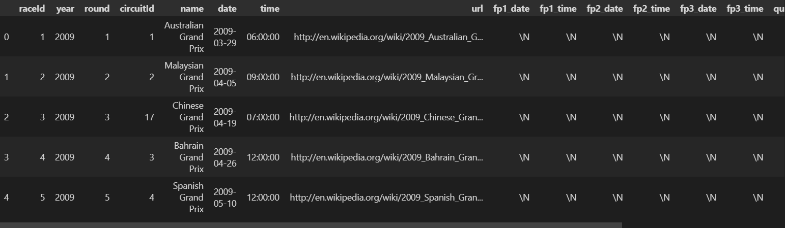

- Al realizar el web scraping, ajustamos los nombres de las columnas, creamos una nueva columna para separar los años de los grandes premios y realizamos otros ajustes finales.

<b>DETALLES DEL WEB SCRAPING</b>

 

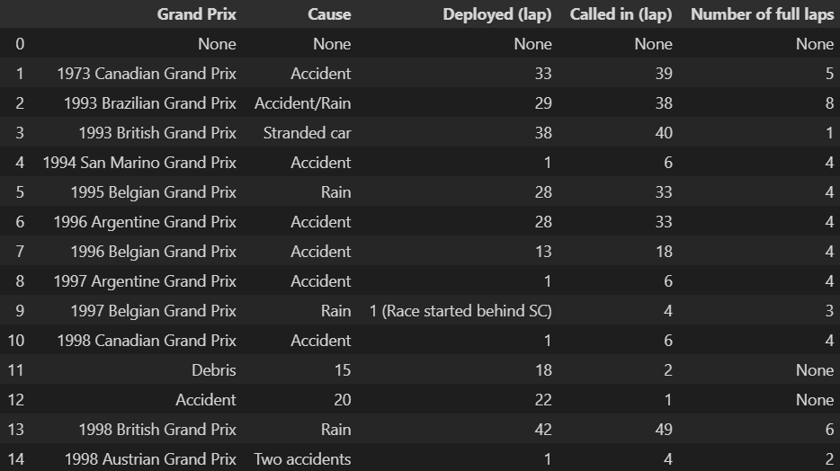

- Utilizamos la librería 'fastf1' para obtener datos sobre el rendimiento de las carreras, lo que nos permite generar gráficos informativos.

<b>DETALLES DE FASTF1</b>

 

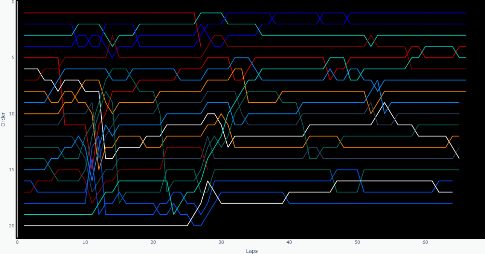

**Carga:**

- En la fase de carga, después de transformar todos los dataframes que utilizaremos para crear nuestro archivo de datos históricos, los cargamos en una base de datos MySQL. Para lograr esto, empleamos la biblioteca SQLAlchemy. A continuación, se muestran diagramas representativos de la estructura de la base de datos:

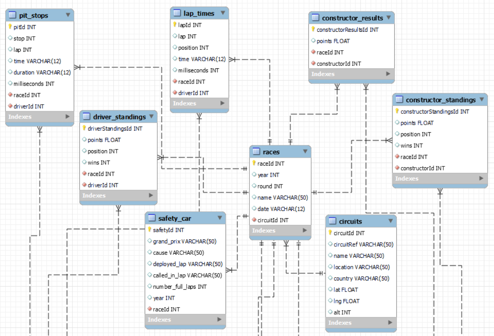
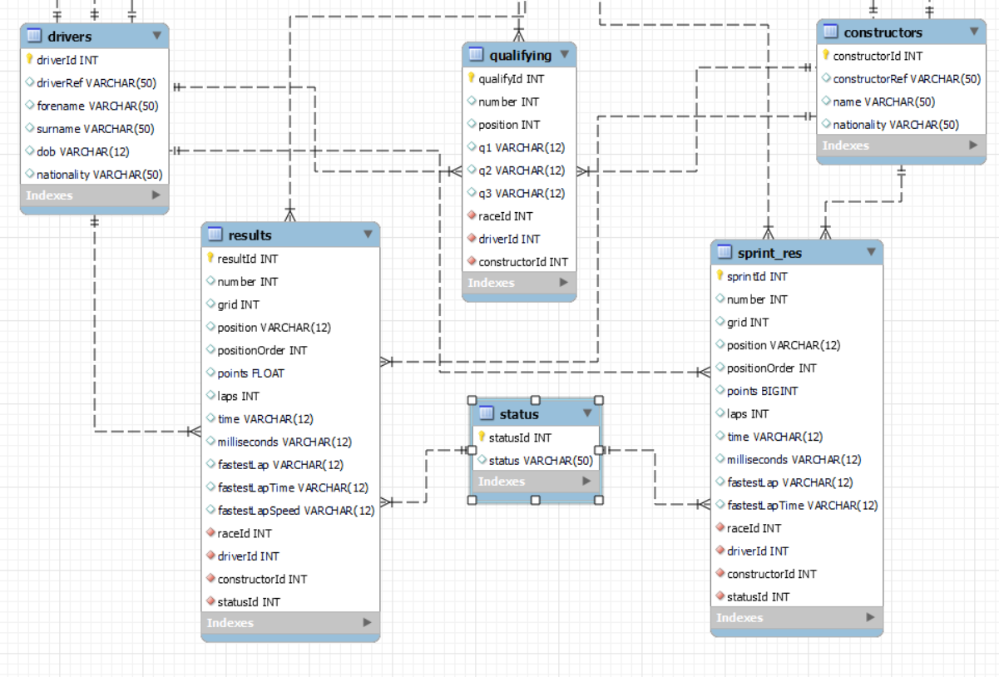

<b>EXPLICACIÓN DEL MODELO ENTIDAD-RELACIÓN</b>

 

El modelo entidad-relación de nuestra base de datos consta de varias tablas que representan diferentes aspectos de la historia de la Fórmula 1. A continuación, se describen las tablas y sus relaciones clave:

1. **Tabla 'races':** Contiene información sobre cada carrera en la historia de la Fórmula 1 y se relaciona con la mayoría de las otras tablas de la base de datos.

2. **Tabla 'drivers':** Almacena información sobre todos los pilotos que han participado en la Fórmula 1. Esta tabla se relaciona principalmente con 'driver_standings', que incluye detalles sobre la posición y los puntos de los pilotos en cada carrera.

3. **Tabla 'constructors':** Registra datos de todas las escuderías que han competido en la Fórmula 1 y se relaciona principalmente con 'constructor_standings' y 'constructor_results', que detallan la posición y los puntos de los equipos.

4. **Tabla 'results':** Contiene resultados de cada carrera en la historia de la Fórmula 1 y se relaciona con 'status', que describe eventos ocurridos en las carreras.

5. **Tabla 'sprint_results':** Registra resultados de las carreras de sprint recientes, que son un nuevo formato de competencia en la Fórmula 1. Se relaciona con 'status' y otras tablas.

6. **Tabla 'qualifying':** Contiene información sobre las clasificaciones en la historia de la Fórmula 1 y se relaciona con 'races', 'drivers' y 'constructors'.

7. **Tabla 'lap_times':** Registra tiempos por vuelta en cada Gran Premio y se relaciona con 'races' y 'drivers'.

8. **Tabla 'pit_stops':** Almacena detalles de las paradas en los pits de los pilotos en cada carrera y se relaciona con 'races' y 'drivers'.

9. **Tabla 'circuits':** Contiene datos sobre los circuitos utilizados en la Fórmula 1 y se relaciona exclusivamente con 'races'.

10. **Tabla 'safety_car':** Registra información sobre los coches de seguridad que han aparecido en la historia de la Fórmula 1 y se relaciona exclusivamente con 'races'.

<a name="consultas"/>

## Consultas

Una vez que hemos establecido nuestra base de datos con sus respectivas relaciones, procedemos a realizar algunas consultas de interés que nos ayudarán a encontrar información necesaria para nuestro archivo histórico de la Fórmula 1. Estas consultas están diseñadas para obtener datos relevantes, realizar análisis y explorar aspectos de la Fórmula 1 a través de nuestra base de datos. 

Todas las consultas se realizan mediante SQLAlchemy y se limitan a mostrar los primeros 10 resultados.

<b>Número de Grandes Premios por año</b>

 

<b>Circuitos que han inaugurado el campeonato en más ocasiones</b>

 

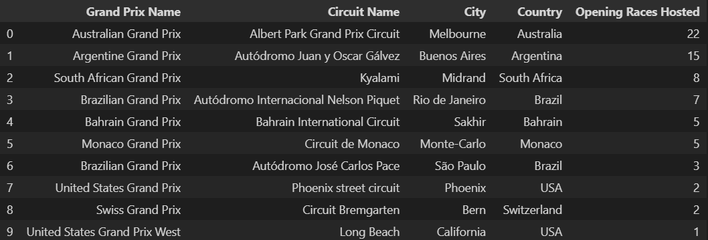

<b>Calendario del 2023</b>

 

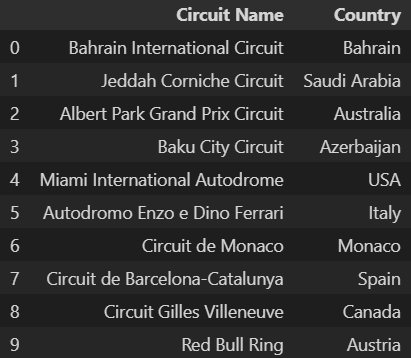

<b>Grandes Premios disputados en más ocasiones a lo largo de la historia</b>

 

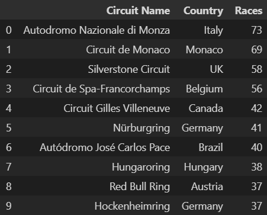

<b>Más apariciones de coches de seguridad por circuitos</b>

 

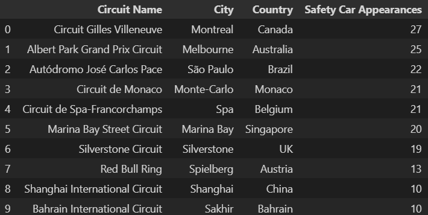

<b>Vueltas más rápidas registradas en cada carrera por año, circuito, país y piloto</b>

 

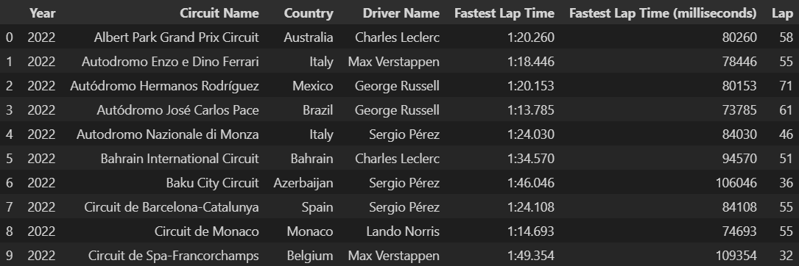

<b>Más victorias por escudería con respecto a sus respectivos pilotos</b>

 

<b>Estado del piloto con respecto al total de sus carreras disputadas</b>

 

<b>Media de velocidad en la vuelta rápida</b>

 

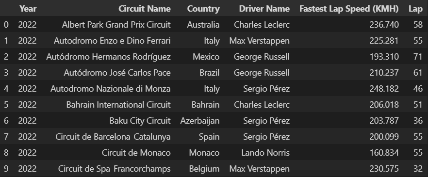

<b>Ganadores de carreras en la Fórmula 1</b>

 

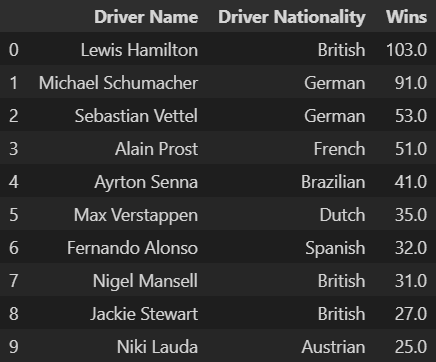

<a name="eda"/>

## Análisis Exploratorio de Datos (EDA)

El objetivo de nuestro EDA es representar gráfica y visualmente los datos que hemos descubierto mediante un análisis y representar y explicar cada uno de ellos. Nos encargaremos de visualizar la distribución de variables clave en nuestro conjunto de datos, examinar cómo han evolucionado ciertas métricas a lo largo de las temporadas de la Fórmula 1, investigar los desempeños de pilotos y equipos a lo largo del tiempo, realizar comparaciones entre diferentes pilotos o equipos y comparar diferentes épocas en la Fórmula 1.

### Dashboard de EDA

A continuación, observamos el siguiente dashboard que hemos realizado y las conclusiones a las que hemos llegado:

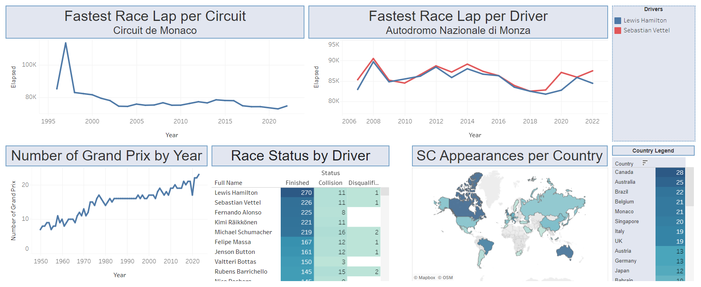

<b>Vueltas rapidas de carrera con el paso del tiempo</b>

 

Tomamos como referencia el período de tiempo desde 1995 hasta 2022 y observamos que con el paso del tiempo en el circuito seleccionado (Circuit de Monaco), han ido disminuyendo los tiempos de vuelta rápida de carrera debido a los avances en los monoplazas de la Fórmula 1.

<b>Comparación de vueltas rapidas de carrera entre pilotos con el paso de los años</b>

 

Tomamos como referencia el período de tiempo desde 2007 hasta 2022, ya que es el año en el que debutaron ambos pilotos seleccionados. Observamos que a lo largo de los años en el circuito seleccionado (Autodromo Nazionale di Monza), el piloto Sebastian Vettel ha sido más predominante en cuanto a las vueltas rápidas de carrera que el piloto Lewis Hamilton.

<b>Número de grandes premios con el paso del tiempo</b>

 

En este caso, disponemos de datos históricos completos del número de Grandes Premios disputados desde 1950 hasta 2023. Observamos que con el paso de los años, el número de Grandes Premios disputados ha aumentado constantemente en la gran mayoría de temporadas de la Fórmula 1.

<b>Desempeño de los pilotos en todas sus carreras disputadas</b>

 

En este caso, contamos con el desempeño histórico de todas las carreras disputadas por los pilotos de la Fórmula 1. Podemos observar estadísticas como las veces que han finalizado una carrera, las veces que han tenido colisiones o las veces que han sido descalificados de una carrera.

<b>Apariciones de safety cars por países</b>

 

Tomamos como referencia el período de tiempo desde 1973 hasta 2022, ya que a pesar de que la primera aparición de un safety car fue en 1973, no se incluyó en el reglamento de la Fórmula 1 hasta 1993. Observamos los diferentes países en los que ha aparecido el safety car en más ocasiones, lo que muestra la tendencia de su aparición en un país o circuito determinado.

<a name="página"/>

## Desarrollo de la Página Web

